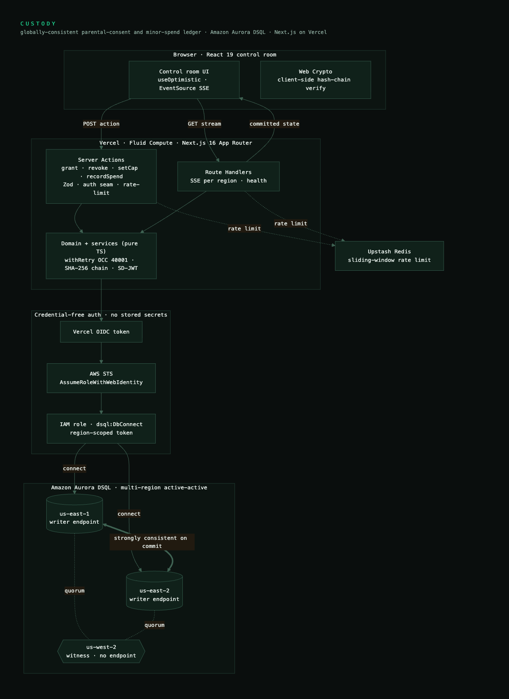

# CUSTODY

**A neutral system-of-record for parental consent and minor-spend control, strongly consistent across regions on commit.**

Custody is a globally-consistent consent and spending-cap ledger for gaming, social, and entertainment platforms. A parent grants or revokes consent and sets a spending cap for a minor, and the decision is strongly consistent across regions the moment it commits, backed by a per-user SHA-256 hash chain you can verify live. All data is synthetic operational data: no real minors, no biometrics, no personal data.

Built for the H0 hackathon (Hack the Zero Stack with Vercel v0 and AWS Databases), Track 3 (million-scale global app).

[](LICENSE)
[](https://nextjs.org)
[](https://aws.amazon.com/rds/aurora/dsql/)
[](https://custody-zeta.vercel.app)
[](https://github.com/StephenSook/custody/actions/workflows/ci.yml)

## Live demo

- **App:** [custody-zeta.vercel.app](https://custody-zeta.vercel.app) (Vercel production, on a real two-region Aurora DSQL cluster)
- **Video:** walkthrough link added at submission
- **The four showpieces:** the two-region link with a commit-latency timer, the hash-chain tamper-and-verify, the OCC contention panel with a deliberate hot-key retry, and the SD-JWT age-bracket proof

> Grant or revoke consent on the live app and both region panels reflect the committed state. The us-east-2 panel reads the second regional endpoint, so what you see is real cross-region consistency, not a local animation.

## The problem

When a parent revokes consent or hits a spend cap on a global platform, the decision often does not take effect everywhere at once. The child can keep playing, or keep spending, in another region while the systems reconcile, and the platform holds no verifiable proof of when the parent acted. Custody closes that window.

## What it does

- **Cross-region consent revocation.** Revoke in one region and the committed state is strongly consistent in the paired region. A live arc and a millisecond timer show commit in Region A becoming visible in Region B.
- **Cross-region spend-cap enforcement.** A spend that would breach the cumulative cap is declined against the strongly-consistent total, regardless of which region the spend arrives in.
- **Tamper-evident audit trail.** Every event is a link in a per-user SHA-256 hash chain over canonical JSON. A Verify button re-hashes the chain client-side and turns every block red from the first broken index.
- **Selective age-bracket proof.** An SD-JWT discloses only an age bracket, never the date of birth. This is selective disclosure (RFC 9901), not a full zero-knowledge proof, and we do not claim one.

## Custody in one commit

> A parent revokes consent in Region A. Custody appends a tamper-evident event and updates the per-user projection in the same transaction, then commits. There is no window where Region B still reads the old state. The commit pays roughly two cross-region round trips, and an optimistic-concurrency retry can add time. We never call this instant. We call it strongly consistent on commit, with no vulnerable window.

## What is real

We would rather you check than take our word.

| Component | Status | What it is |
|---|---|---|
| Cross-region consent + spend ledger | **WIRED LIVE** | Amazon Aurora DSQL active-active across us-east-1 and us-east-2 with a us-west-2 witness, strongly consistent on commit. Verified live: a write in one region is read from the other endpoint on commit. |
| OCC retry + idempotency | **WIRED LIVE** | every write goes through the `withRetry` wrapper; concurrent same-user appends collide on the composite primary key, surface SQLSTATE 40001, and one retries. Replays are no-ops via a unique idempotency key. |
| Hash-chain audit trail | **WIRED LIVE** | per-user SHA-256 chain over canonical JSON (RFC 8785); verify pinpoints the exact first broken index. |
| SD-JWT age-bracket proof | **WIRED LIVE** | real selective disclosure via `@sd-jwt/core`; the date of birth never appears in the presented token. Not a ZKP, and no holder key binding is claimed. |
| Credential-free auth | **WIRED LIVE** | Vercel OIDC federates to an AWS IAM role to a region-scoped DSQL token. No database password exists anywhere. |
| Data | **SYNTHETIC** | synthetic operational data only: no real minors, no biometrics, no personal data. |

The correctness core is built test-first: 88 tests (83 unit, 5 live-DSQL integration including a cross-region read-after-commit and an eight-way concurrent-append chain-integrity check).

## Architecture

Three strict layers: a Next.js transport boundary, a framework-independent domain and crypto core, and a data-access layer that is the only thing that touches Aurora DSQL.

```mermaid
flowchart LR
  P["Parent / platform<br/>action"] --> SA["Server Action<br/>Zod-validated, authz re-checked, rate-limited"]
  SA --> OCC["withRetry (OCC)<br/>retry on SQLSTATE 40001"]
  OCC --> APP["Append event + update<br/>projection, same transaction"]
  APP --> HASH["SHA-256 hash chain<br/>over canonical JSON"]
  HASH --> DSQL[("Amazon Aurora DSQL<br/>active-active, 2 regions")]
  DSQL -->|"strongly consistent on commit"| SSE["SSE streams<br/>one per region"]
  SSE --> UI["Region A + Region B panels<br/>arc + latency timer"]
```



Connection path: Vercel OIDC federation to an AWS IAM role to a region-scoped DSQL IAM token. There is no stored database password. The full deployment topology, including the witness region and the credential-free auth chain, is in [docs/architecture.md](docs/architecture.md):



## Tech stack

- **Frontend:** Next.js 16 (App Router), React 19, Tailwind CSS v4 (OKLCH tokens), Motion, server-sent events for the live cross-region streams.
- **Database:** Amazon Aurora DSQL, active-active multi-region (us-east-1 + us-east-2, us-west-2 witness), accessed with `@aws/aurora-dsql-node-postgres-connector`.
- **Auth:** Vercel OIDC to an AWS IAM role via `@vercel/oidc-aws-credentials-provider`. No stored secrets.
- **Crypto:** Web Crypto SHA-256 hash chain over RFC 8785 canonical JSON; SD-JWT selective disclosure via `@sd-jwt/core`.
- **Platform:** Vercel (Fluid Compute), Upstash Redis for rate limiting, GitHub Actions CI.

## Quickstart

```bash
pnpm install
cp .env.example .env.local                 # regional endpoints, no DB password (OIDC)
pnpm migrate east && pnpm migrate west      # one DDL per transaction, async indexes
pnpm seed                                   # synthetic operational data, no real minors
pnpm dev                                    # http://localhost:3000
```

Verify the correctness core:

```bash
pnpm typecheck && pnpm lint && pnpm test && pnpm build
```

Provisioning the live two-region cluster and the Vercel OIDC wiring is scripted in
[`scripts/provision/`](scripts/provision) and documented in [docs/SETUP-AWS-DSQL.md](docs/SETUP-AWS-DSQL.md).

## Security and data posture

- Credential-free: no database password exists; the runtime connects through Vercel OIDC to a region-scoped DSQL token.
- Every Server Action re-validates with Zod and re-checks authorization inside the action, not at the page.
- The public demo runs on synthetic data, an append-only ledger that cannot be wiped, Upstash rate limiting on mutation routes, and a least-privilege database role scoped to read, append, and projection-upsert (no delete, no DDL).
- No raw date of birth, identity, or biometrics are ever stored. Age is held as a bracket plus a credential hash.

## License

Apache-2.0. See [LICENSE](LICENSE) and [NOTICE](NOTICE).
