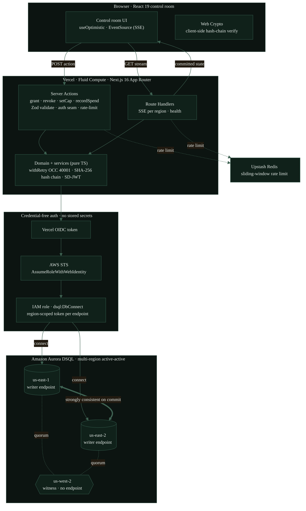

# Custody architecture

Three strict layers (transport, domain plus services, data access), credential-free auth via
Vercel OIDC, and an active-active multi-region Aurora DSQL spine. No stored database secret
exists anywhere in the system.

## Data flow

1. A parent action (grant, revoke, set cap, record spend) is a Server Action. The transport
   layer validates input with Zod, re-checks the auth seam, and rate-limits the caller.
2. The domain layer appends an event and updates the per-entity projection in one transaction,
   wrapped in `withRetry`. Concurrent same-entity writes collide on the composite primary key
   `(entity_id, seq)`, surface SQLSTATE 40001 (OC000) at commit, and one writer retries against
   the fresh chain tip. The chain never forks.
3. The write commits to Aurora DSQL. The cluster is active-active across us-east-1 and us-east-2
   with a us-west-2 witness for quorum, so the committed state is strongly consistent on commit
   with no vulnerable window. The commit pays roughly two cross-region round trips.
4. Both regional Route Handlers stream the committed state over SSE. The client panels for both
   regions reflect it, and the deck.gl arc animates the cross-region propagation.

## Correctness and crypto

- Append-only event tables plus derived per-entity projections (never a global counter row,
  which would be a hot key). The audit trail is a per-user SHA-256 hash chain over canonical
  JSON (RFC 8785), verifiable client-side with Web Crypto.
- Age is proven with SD-JWT selective disclosure (RFC 9901): the holder discloses only an age
  bracket, never the date of birth. No full ZKP is claimed.

## Security posture

- Credential-free: Vercel OIDC federates to an AWS IAM role; there is no stored database
  password. The runtime role is scoped to `dsql:DbConnect` on the cluster.
- Every Server Action re-validates and re-authorizes inside the action, not at the page.
- The public demo runs on synthetic data, an append-only ledger that cannot be wiped, and
  Upstash rate limiting on mutation routes.
